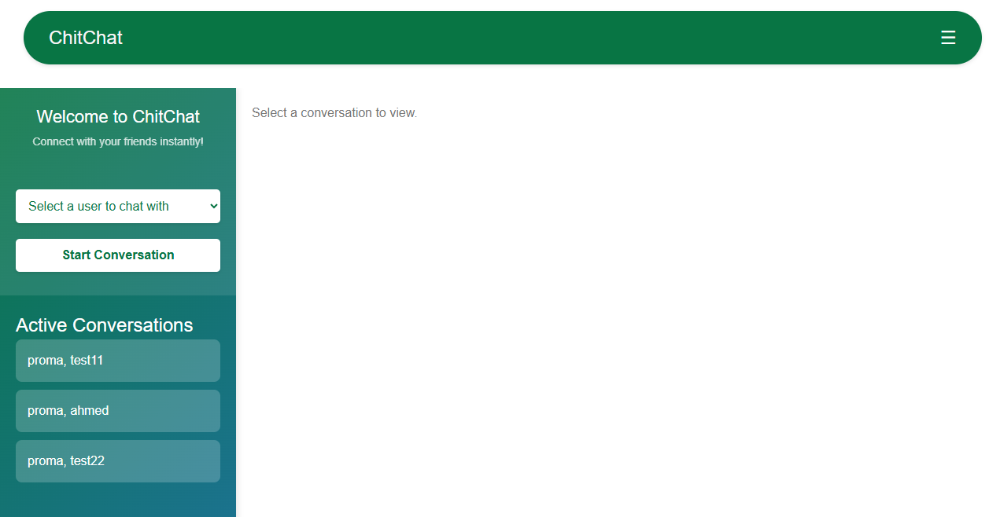

<h1 align="center">Real-Time Chat Application with Django & React</h1>

<div align="justify">
Currently building a powerful real-time chat app from scratch using Django Channels and React.
This repository contains all the resources needed to build a robust, real-time chat system using Django for the backend and React for the frontend. 
The system supports real-time messaging, online status indicators, typing indicators, and user authentication.
</div>

---

## Table of Contents

- [Key Features](#key-features)
- [Tech Stack](#tech-stack)
- [Know About WebSocket](#know-about-websocket)
- [Project Structure](#project-structure)
- [Getting Started](#getting-started)
- [Key Components](#key-components)
- [Additional Feature to Explore](#additional-feature-to-explore)
- [Screenshots](#screenshots)

---

## Key Features

### Backend:

- **WebSocket Integration**: Utilizes Django Channels to support WebSocket connections for real-time messaging.
- **Redis**: Acts as the message broker to enable WebSocket functionality and handle asynchronous events.
- **Daphne**: A production-ready ASGI server used to serve WebSocket and HTTP traffic.
- **Message Persistence**: Messages are stored in a PostgreSQL or SQLite database using Django ORM.
- **Authentication**: Supports token-based authentication for secure communication.
- **Online and Typing Indicators**: Real-time updates for online users and typing notifications.
- **Role-based Access**: Ensures users can only access conversations they are part of.
- **Swagger UI for API Documentation**: Added Swagger UI (via drf-yasg) to automatically generate interactive API documentation

### Frontend:

- **Real-Time Updates**: Leverages WebSocket to provide instant message delivery.
- **User Interface**: Built using React with a clean and responsive design.
- **Online Status Display**: Shows a list of online users in the conversation.
- **Typing Indicators**: Displays when another user is typing in the conversation.
- **Authentication and Authorization**: Uses JWT for managing user sessions.
- **Error Handling**: Graceful handling of network and server errors.
---

## Tech Stack
This project leverages the following technologies:

| **Layer**              | **Technology**                                                                | **Description**                                       |
| ---------------------- | ----------------------------------------------------------------------------- | ----------------------------------------------------- |
| 🐍 Language            | [Python 3.10+](https://www.python.org/)                                       | Core programming language                             |
| 🌐 Backend Framework   | [Django 5+](https://www.djangoproject.com/)                                      | High-level Python web framework                       |
| 🔗 API Toolkit         | [Django REST Framework](https://www.django-rest-framework.org/)               | Flexible toolkit to build Web APIs                    |
| 🔄 Real-time Framework | [Django Channels](https://channels.readthedocs.io/)                           | Adds WebSocket and async support to Django            |
| ⚙️ ASGI Server         | [Daphne](https://github.com/django/daphne)                                    | ASGI server to run Django Channels                    |
| ⚛️ Frontend Framework  | [React](https://reactjs.org/)                                                 | JavaScript library for building UIs                   |
| ⚡ Frontend Tooling    | [Vite](https://vitejs.dev/)                                                   | Fast frontend build tool and dev server               |
| 🌐 Real-time Protocol  | [WebSockets](https://developer.mozilla.org/en-US/docs/Web/API/WebSockets_API) | Bi-directional real-time communication                |
| 🧰 Message Broker      | [Redis](https://redis.io/)                                                    | In-memory data structure store, used as channel layer |
| 📚 Docs Generator      | [drf-yasg](https://drf-yasg.readthedocs.io/)                                  | Auto-generate Swagger/OpenAPI docs                    |
| 🟩 Runtime Environment | [Node.js](https://nodejs.org/)                                                | JavaScript runtime for building and running tools     |

---

## Know About WebSocket

WebSocket provides a persistent connection between the client and server, enabling bi-directional communication without waiting for a server response like HTTP. 
This is crucial for achieving real-time functionality.

To set up WebSocket in Django:

#### 1. Install the Django Channels library:

```bash
pip install channels_redis
pip install daphne
```

#### 2. Update your settings.py to configure Channels and Redis:

```python
INSTALLED_APPS = [
    ...
    'channels',
]

ASGI_APPLICATION = "chatsystemproj.asgi.application"

CHANNEL_LAYERS = {
    "default": {
        "BACKEND": "channels_redis.core.RedisChannelLayer",
        "CONFIG": {
            "hosts": [("127.0.0.1", 6379)],
        },
    },
}
```

#### 2. Update your settings.py to configure Channels and Redis:

```bash
sudo apt install redis-server
sudo service redis-server start
redis-cli ping  # Should return PONG
```

---

## Project Structure

### Backend:

- **`chatapp/`**: Contains the core logic for managing conversations and messages.
- **`chatsystemproj/`**: The Django project folder, including settings and ASGI configuration.
- **`asgi.py`**: Configures the ASGI application to handle WebSocket connections.
- **`consumers.py`**: Implements WebSocket consumers for handling real-time communication.

### Frontend:

- **React Components**:
  - `Conversation.jsx`: Manages real-time chat UI and WebSocket communication.
  - `Login.jsx` and `Register.jsx`: Handles user authentication.
  - `ChatList.jsx`: Displays the list of conversations.

- **CSS Styles**: Custom styles for a responsive and user-friendly interface.

---

## Getting Started

### Backend Setup

  1. Create and Activate a Virtual Environment

  <details>
  <summary><strong>macOS / Linux</strong></summary>
      
  ```bash
  python -m venv venv
  source venv/bin/activate
  ```
  </details> 
  
  <details> 
  <summary><strong>Windows</strong></summary>
      
  ```bash
  python -m venv venv
  . venv\Scripts\activate
  ```
  </details>

  2. Navigate to the Backend Directory: 
  
  ```bash
  cd chat_project
  ```
  
  3. Install Dependencies: 
  
  ```bash
  pip install -r requirements.txt
  ```
  
  4. Run Migrations: 
  
  ```bash
  python manage.py migrate
  ```
  
  #### 5. Run the Development Server:
  
  ```bash
  python manage.py runserver
  ```
  
  6. Run Daphne (for WebSocket support):
  
  ```bash
  daphne -b 0.0.0.0 -p 8000 chatsystemproj.asgi:application
  ```

### Frontend Setup

  1. Navigate to the Frontend Directory:
  
  ```bash
  cd frontend
  ```
  
  2. Install Dependencies: 
  
  ```bash
  npm install
  ```
  
  3. Start the Development Server: 
  
  ```bash
  npm run dev
  ```

---

## Key Components

### Backend:

- **WebSocket Consumers**: Handles incoming and outgoing WebSocket messages, including:
  - Message broadcasting.
  - Typing notifications.
  - Online user status updates.

- **REST API**: Provides endpoints for:
  - Fetching conversation messages.
  - Creating new messages.
  - Managing user authentication.

---

### Frontend:

- **WebSocket Client**:
  - Connects to the backend WebSocket server.
  - Sends and receives real-time events (messages, typing indicators).

- **Message List**: Displays messages with a distinction between sent and received messages.

- **Typing Indicator**: Displays the name of the user typing in the chat.

---

## Additional Feature to Explore

- **Message Deletion**: Enable users to delete messages from conversations.

---

## Screenshots





